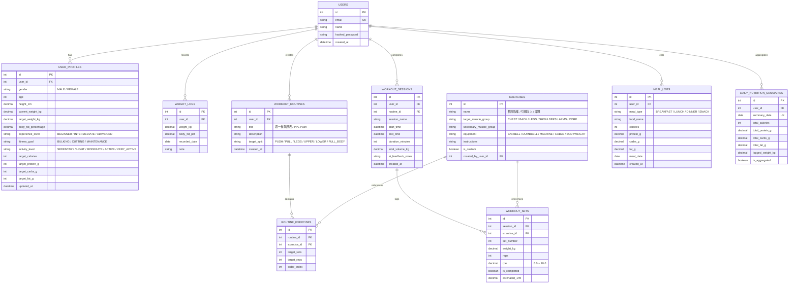

# ⚡ FitPulse (脈動健身) - 智慧健身訓練與營養追蹤 PWA 系統規格與架構藍圖

> 一款專為重訓與體態管理打造的 **行動優先 PWA 智慧健身應用**，結合「AI 智能今日排課、肌肉修復熱力圖、漸進式超負荷追蹤、動態 TDEE 宏觀營養計算、AI 純文字自然語言飲食解析、即問即用無負擔 AI 對話（支援一鍵載入菜單）與實戰訓練打卡」。

---

## 🎯 系統定位與核心痛點解決方案

### 🏋️ 痛點 1：今天不知道要練什麼？（AI 智能排課教練 ＋ 聊天一鍵採用）
- **肌肉修復熱力圖（Muscle Recovery Status）**：即時分析過去 24~72 小時各肌群（胸、背、腿、肩、手臂、核心）的訓練量與間隔時間，標註恢復狀態（已充分恢復、恢復中、修復中）。
- **Gemini AI 智能排課引擎（零儲存負擔）**：
  - 首頁一鍵「AI 智能推薦今日課表」或進入「AI 教練對話」。
  - **對話不落盤存 DB**：離開即重置，不佔用任何資料庫空間。每次對話自動攜帶當前用戶資料（性別、年資、目標、近幾日訓練部位）作為即時 Prompt Context。
  - **聊完一鍵採用（Adopt Routine）**：AI 產出建議菜單時，前端提供「👉 採用此菜單並開始訓練」按鈕，點擊後直接將動作清單帶入今日訓練打卡畫面！

### 📊 痛點 2：進階與新手如何科學追蹤進步？（漸進式超負荷與 1RM 追蹤）
- **訓練中實時打卡模式**：即時顯示「上次該動作之最高重量與組數」，自動提示漸進式超負荷目標（如：已達標，建議下次加重 2.5kg）。
- **組間休息倒數計時器**：內建 60s / 90s / 120s / 180s 休息倒數，支援聲音與震動提醒。
- **1RM 估算與三大項成長曲線**：自動依據 Epley 公式推算估算單次最大重量（$1RM = Weight \times (1 + Reps/30)$），繪製臥推、深蹲、硬舉與核心動作歷史進步曲線。

### 🥗 痛點 3：飲食記錄繁瑣、極致省空間？（純文字 AI 解析 ＋ 30 天滾動歸檔 ＋ 零圖片儲存）
- **極低 Token 純文字 AI 辨識**：
  - **不儲存任何照片**，避免任何免費雲端空間爆量風險。
  - 使用者只要打字（或語音轉文字）：「好市多烤雞腿 1 隻 + 地瓜 150g」或「超商大飯糰 + 無糖高纖豆漿」，Gemini 純文字解析消耗不到 100~200 Tokens，毫秒級萃取出「食物名稱、估算熱量 (kcal)、蛋白質 (P)、碳水 (C)、脂肪 (F)」。
  - 使用者快速校對數值後一鍵入庫。
- **30 天自動滾動清理機制（Rolling Aggregation）**：系統保留近 30 天詳細餐點明細；超過 30 天的資料自動彙總濃縮為「每日總卡路里與宏觀營養摘要」，永久保存歷史趨勢且資料庫體積極小（幾百 KB 可存數年）。

### 👥 痛點 4：多用戶獨立使用（自己、女友、朋友）
- **原生 JWT 帳號系統**：各自註冊獨立帳號，資料庫以 `user_id` 嚴格隔離，保護個人隱私與體態數據。
- **客製化身體檔案與動態 TDEE**：個人化計算 BMR (Mifflin-St Jeor 公式) 與活動係數，自動設定增肌熱量盈餘 (+200~300 kcal) 或減脂熱量赤字 (-300~500 kcal)。

---

## 🛠️ 技術架構選型

```mermaid
graph TD
    Client["📱 PWA Client (Vue 3 + Vite PWA + Pinia + Tailwind CSS + Lucide Icons + Chart.js)"]
    API["⚡ FastAPI Server Engine (Render / Python 3.11+)"]
    DB[("🐬 TiDB Serverless (MySQL 8 Compatible) via SQLAlchemy 2.0")]
    AI["✨ Google Gemini API (gemini-2.5-flash / gemini-3.1-lite)"]

    Client -->|HTTP / RESTful API + JWT Auth| API
    API -->|SQLAlchemy ORM Queries| DB
    API -->|Contextual Prompts (Stateless, Zero-DB)| AI
```

| 層級 | 技術選型 | 說明 |
| :--- | :--- | :--- |
| **前端框架** | **Vue 3 (Composition API + Vite)** | 行動端響應式 SPA，流暢極簡打卡與互動體驗 |
| **狀態管理** | **Pinia + PersistedState** | 管理使用者資訊、今日訓練 Session、計時器、快取資料 |
| **UI 與樣式** | **Tailwind CSS + Lucide Icons** | **Apple Health 風格極簡灰白主題**（純白、淺灰底、柔和藍綠/珊瑚橘漸層）、現代圓角卡片 |
| **圖表可視化** | **Chart.js + vue-chartjs** | 體重 7 天平滑趨勢圖、三大營養素圓餅/進度環、1RM 肌力曲線、容量分析 |
| **行動端 PWA** | **vite-plugin-pwa** | 支援加入手機主畫面 (iOS / Android 全螢幕體驗)、離線靜態資源快取 |
| **後端框架** | **FastAPI (Python 3.11+)** | 高效異步 API 框架、自動生成 Swagger/OpenAPI 文件、Pydantic v2 資料驗證 |
| **資料庫與 ORM** | **TiDB Serverless + SQLAlchemy 2.0** | 免費 5GB 雲端 MySQL 相容資料庫，支援 SSL 連線，高擴展與高可用 |
| **AI 核心** | **Google GenAI SDK (Gemini)** | 純文字輕量化解析、無狀態智慧排課、菜單一鍵帶入打卡 |
| **驗證與安全** | **JWT (PyJWT) + Bcrypt (passlib)** | 密碼安全雜湊、Token 身份驗證、資料隔離 |

---

## 📐 資料庫綱要設計 (精簡零浪費版 Database Schema)

> 註：已完全移除 `AI_CHAT_LOGS`（對話無狀態不存 DB）與 `image_url`（純文字/數值記錄，零圖檔負擔）。



---

## 🚀 核心模組操作流程

### 1. 🥗 飲食打卡（純文字 AI 秒級解析，零圖片）
1. 進入「飲食」頁籤，點選「+ 新增餐點」。
2. 輸入文字或選擇快速標籤（例：`全家烤雞胸肉 1 片 + 蒸地瓜 150g + 無糖豆漿 400ml` 或 `牛肉麵大碗 + 燙青菜`）。
3. 點擊「✨ AI 解析」：後端發送輕量 Prompt 至 Gemini，回傳格式化數值（熱量 480 kcal、蛋白質 42g、碳水 45g、脂肪 8g）。
4. 使用者可手動微調數字，點擊「確定入庫」。
5. **容量守護機制**：近 30 天內保留每筆餐點名稱與營養素，滿 30 天系統自動彙總為每日一行 `daily_nutrition_summaries`，資料庫佔用接近 0。

### 2. 🤖 AI 隨身教練（即問即用、無狀態、一鍵載入訓練）
1. 點擊「AI 教練」頁籤，對話視窗開啟（新會話，不載入歷史 DB，離開即重置）。
2. 發問時系統自動在 Prompt 前夾帶 Context：
   - 用戶資料：性別、體重、目標（增肌/減脂）、經驗級別。
   - 肌肉狀態：胸(已修復)、背(疲勞中)、腿(已修復)...
3. 使用者可以直接問：
   - *「我今天想練 45 分鐘胸和三頭，器材只有啞鈴和臥推椅，請幫我排課」*
4. AI 回覆詳細建議，並在結尾輸出結構化菜單區塊。
5. 前端渲染該區塊時，下方自動顯示 **【👉 一鍵載入今日訓練】** 按鈕。
6. 點擊後，系統直接跳轉至「訓練中打卡」介面，自動填好動作、目標組數與預設次數，立刻開始運動！

### 3. 🏋️ 訓練打卡與漸進式超負荷
1. 進入訓練頁面，動作清單依序呈現。
2. 填寫每組「重量 (kg) / 次數 (reps)」，輸入框上方會淡灰色提示「上次：60kg × 8次」。
3. 點擊打勾完成一組 -> 自動觸發組間休息倒數浮動球（60s / 90s / 120s）。
4. 點擊「結束訓練」-> 自動計算總訓練量 (Volume)、推算各動作 1RM，並更新肌肉修復時鐘。

---

## 🎨 UI/UX 設計風格 (Apple Health 潔淨風格)
- **主色調**：清亮翠綠/湖水綠 (`#10B981`)
- **副色調**：珊瑚暖橘 (`#F97316`) 與 晨曦湛藍 (`#3B82F6`)
- **背景底色**：純白 (`#FFFFFF`) 與柔和淺灰 (`#F8FAFC`)
- **PWA 導航**：底部五大核心頁籤（🏠 今日概覽、🏋️ 訓練庫與打卡、🥗 飲食打卡、📈 趨勢分析、🤖 AI 教練）
